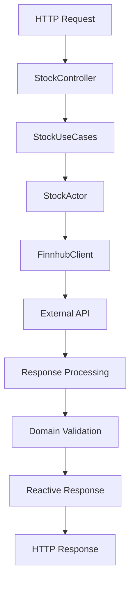
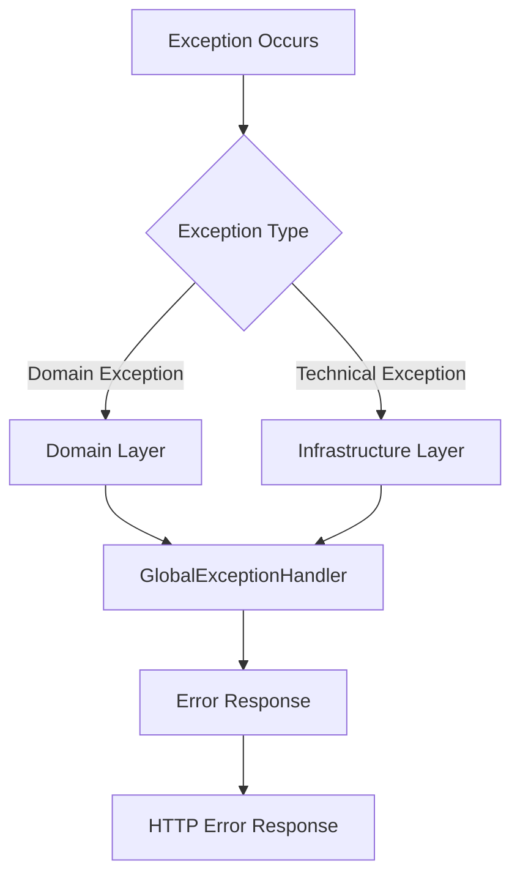

# Architecture Documentation

## Overview

This document describes the architectural design and patterns used in the Stock Service application. The system follows **Hexagonal Architecture** principles with reactive programming patterns and actor-based concurrency.

## 🏗️ Architectural Patterns

### Hexagonal Architecture (Ports & Adapters)

The application implements Hexagonal Architecture to achieve:
- **Separation of Concerns**: Clear boundaries between business logic and external dependencies
- **Testability**: Easy to test business logic in isolation
- **Flexibility**: Ability to swap implementations without affecting core business logic
- **Maintainability**: Well-organized code structure

```
                    ┌─────────────────────────────────────┐
                    │           Domain Layer              │
                    │  ┌─────────────┐ ┌─────────────────┐│
                    │  │   Stock     │ │  StockSymbol    ││
                    │  │  (Entity)   │ │ (Value Object)  ││
                    │  └─────────────┘ └─────────────────┘│
                    │  ┌─────────────────────────────────┐│
                    │  │        Exceptions              ││
                    │  │ StockNotFoundException          ││
                    │  │ InvalidStockSymbolException     ││
                    │  └─────────────────────────────────┘│
                    └─────────────────────────────────────┘
                                        │
                    ┌─────────────────────────────────────┐
                    │        Application Layer            │
                    │  ┌─────────────┐ ┌─────────────────┐│
                    │  │StockUseCases│ │  StockService   ││
                    │  │(Use Cases)  │ │   (Port)        ││
                    │  └─────────────┘ └─────────────────┘│
                    └─────────────────────────────────────┘
                                        │
        ┌───────────────────────────────┼───────────────────────────────┐
        │                               │                               │
┌───────────────────┐                   │                   ┌───────────────────┐
│   Adapter Layer   │                   │                   │   Adapter Layer   │
│     (Inbound)     │                   │                   │    (Outbound)     │
│ ┌─────────────────┐│                   │                   │┌─────────────────┐│
│ │StockController  ││                   │                   ││  StockActor     ││
│ │(REST API)       ││                   │                   ││  (Pekko Actor)  ││
│ └─────────────────┘│                   │                   │└─────────────────┘│
│ ┌─────────────────┐│                   │                   │┌─────────────────┐│
│ │ExceptionHandler ││                   │                   ││  FinnhubClient  ││
│ │(Error Handling) ││                   │                   ││  (External API) ││
│ └─────────────────┘│                   │                   │└─────────────────┘│
└───────────────────┘                   │                   └───────────────────┘
                                        │
                    ┌─────────────────────────────────────┐
                    │      Infrastructure Layer           │
                    │  ┌─────────────┐ ┌─────────────────┐│
                    │  │PekkoConfig  │ │ LoggingContext  ││
                    │  │(Config)     │ │  (Logging)      ││
                    │  └─────────────┘ └─────────────────┘│
                    │  ┌─────────────────────────────────┐│
                    │  │     Health Indicators           ││
                    │  │  ApplicationHealthIndicator     ││
                    │  │  StockActorHealthIndicator      ││
                    │  └─────────────────────────────────┘│
                    └─────────────────────────────────────┘
```

## 🔄 Reactive Architecture

### Reactive Streams

The application uses **Project Reactor** for reactive programming:

```java
// Non-blocking stock retrieval
public Mono<Stock> getStock(String symbol) {
    return stockService.getStock(symbol);
}

// Non-blocking stream of all stocks
public Flux<Stock> getAllStocks() {
    return stockService.getAllStocks();
}
```

### Benefits of Reactive Programming

1. **Non-blocking I/O**: Efficient resource utilization
2. **Backpressure Handling**: Automatic flow control
3. **Error Propagation**: Elegant error handling in streams
4. **Composability**: Easy to combine async operations

## 🎭 Actor System Architecture

### Apache Pekko Integration

The application uses **Apache Pekko** for:
- **Concurrent Processing**: Parallel stock data processing
- **Message Passing**: Asynchronous communication
- **Fault Tolerance**: Actor supervision and recovery
- **Scalability**: Distributed processing capabilities

```java
// Actor System Configuration
@Configuration
public class PekkoConfig {

    @Bean
    public ActorSystem<Command> actorSystem() {
        return ActorSystem.create(
            StockActor.create(),
            "stock-system"
        );
    }
}
```

### Actor Hierarchy

```
Stock-System (Root Actor)
    └── StockActor (Supervisor)
        ├── StockProcessorActor (Worker)
        ├── StockValidatorActor (Worker)
        └── StockCacheActor (Worker)
```

## 🏛️ Layer Details

### Domain Layer

**Purpose**: Contains core business logic and entities
**Components**:
- `Stock`: Core entity representing stock data
- `StockSymbol`: Value object with validation rules
- `StockNotFoundException`: Domain exception
- `InvalidStockSymbolException`: Domain exception

**Principles**:
- No dependencies on external frameworks
- Pure business logic
- Immutable entities using records
- Rich domain models with behavior

### Application Layer

**Purpose**: Orchestrates business operations
**Components**:
- `StockUseCases`: Main business logic orchestrator
- `StockService`: Port interface for stock operations

**Responsibilities**:
- Coordinate between domain and infrastructure
- Handle business workflows
- Implement use cases
- Manage transactions and consistency

### Adapter Layer

#### Inbound Adapters (Driving)
**Purpose**: Handle external requests
**Components**:
- `StockController`: REST API endpoints
- `GlobalExceptionHandler`: Error handling

#### Outbound Adapters (Driven)
**Purpose**: External integrations
**Components**:
- `StockActor`: Pekko actor for processing
- `FinnhubClient`: External API integration

### Infrastructure Layer

**Purpose**: Technical concerns and configuration
**Components**:
- `PekkoConfig`: Actor system configuration
- `LoggingContext`: Structured logging
- `TracingConfiguration`: Distributed tracing
- Health indicators and monitoring

## 🔧 Design Patterns

### 1. Command Pattern
Used in the actor system for message handling:

```java
public sealed interface Command {
    record GetStock(String symbol, ActorRef<StockResponse> replyTo)
        implements Command {}

    record GetAllStocks(ActorRef<List<Stock>> replyTo)
        implements Command {}
}
```

### 2. Repository Pattern
Abstracted through ports:

```java
public interface StockService {
    Mono<Stock> getStock(String symbol);
    Flux<Stock> getAllStocks();
}
```

### 3. Factory Pattern
Used for creating actor instances:

```java
public static Behavior<Command> create() {
    return Behaviors.setup(StockActor::new);
}
```

### 4. Strategy Pattern
Used for different stock data processing strategies:

```java
public interface StockProcessingStrategy {
    Mono<Stock> process(String symbol);
}
```

## 🚀 Reactive Flow

### Request Processing Flow



### Error Handling Flow



## 📊 Observability Architecture

### Metrics Collection

```
Application --> Micrometer --> Prometheus --> Grafana
```

### Distributed Tracing

```
Request --> OpenTelemetry --> Jaeger --> Trace Visualization
```

### Logging Pipeline

```
Application --> Logback --> JSON Format --> Loki --> Grafana
```

### Health Monitoring

```
Health Checks --> Spring Actuator --> Prometheus --> Alertmanager
```

## 🔒 Security Considerations

### Input Validation
- **Stock Symbol Validation**: Regex pattern validation
- **Request Validation**: Spring validation annotations
- **Actor Message Validation**: Type-safe message handling

### Error Handling
- **No Sensitive Data Exposure**: Generic error messages
- **Proper HTTP Status Codes**: RESTful error responses
- **Logging Security**: No sensitive data in logs

## 🎯 Performance Optimizations

### Reactive Optimizations
- **Non-blocking I/O**: Efficient thread utilization
- **Connection Pooling**: Reuse HTTP connections
- **Caching**: In-memory caching for frequently accessed data

### JVM Optimizations
- **ZGC**: Low-latency garbage collection
- **JIT Compilation**: Optimized bytecode execution
- **Memory Management**: Efficient heap utilization

### Actor System Optimizations
- **Message Batching**: Process multiple messages together
- **Actor Pooling**: Reuse actor instances
- **Dispatcher Tuning**: Optimized thread pool configuration

## 📈 Scalability Patterns

### Horizontal Scaling
- **Stateless Design**: No session state in application
- **Actor Distribution**: Distribute actors across nodes
- **Load Balancing**: Multiple application instances

### Vertical Scaling
- **Resource Optimization**: Efficient CPU and memory usage
- **Connection Pooling**: Maximize connection reuse
- **Caching Strategy**: Reduce external API calls

## 🔄 Evolution Strategy

### Future Enhancements
1. **Event Sourcing**: Capture state changes as events
2. **CQRS**: Separate read and write models
3. **GraphQL**: Flexible query interface
4. **WebSockets**: Real-time stock updates

### Migration Path
1. **Gradual Refactoring**: Incremental improvements
2. **Feature Flags**: Safe feature rollouts
3. **Blue-Green Deployment**: Zero-downtime updates
4. **Canary Releases**: Gradual feature rollouts

## 🏆 Best Practices

### Code Organization
- **Package by Feature**: Group related functionality
- **Clear Boundaries**: Well-defined layer interfaces
- **Dependency Injection**: Loose coupling between components

### Testing Strategy
- **Unit Testing**: Test individual components
- **Integration Testing**: Test component interactions
- **Contract Testing**: Validate API contracts
- **End-to-End Testing**: Complete user workflows

### Monitoring and Observability
- **Structured Logging**: Consistent log format
- **Metrics Collection**: Key performance indicators
- **Distributed Tracing**: Request flow visibility
- **Health Checks**: System health monitoring

---

This architecture provides a solid foundation for a scalable, maintainable, and observable stock service while following modern software engineering principles.
